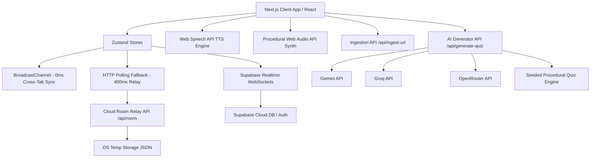

# QuizFlow Tech Stack & Architecture Context

This document provides a detailed technical mapping of the QuizFlow platform's architecture, dependencies, frameworks, and APIs. It serves as the primary technical context for development and deployment.

---

## 1. Core Tech Stack Overview

| Technology / Library | Version | Role in Architecture |
| :--- | :--- | :--- |
| **Next.js** | `14.2.35` | Core Web Application Framework (App Router, Server Actions, Route Handlers) |
| **React** | `18.2.0` | Frontend UI Component Library & State Render Engine |
| **TypeScript** | `5.3.3` | Type-safety, component interface strictness, and state schemas |
| **Tailwind CSS** | `3.4.1` | Utility-first CSS Styling (heavy outline comic/bento visual identity) |
| **Supabase JS SDK** | `2.112.2` | Database Sync, Real-time WebSockets, and Cloud Host Authentication |
| **Zustand** | `4.5.1` | Client-side state management (productivity and game session stores) |
| **Socket.io Client** | `4.7.4` | Reserved client-side real-time WebSocket communication capability |
| **dnd-kit** | `^6.1.0` | Drag-and-drop mechanics (Kanban board layout and dashboard customizer) |
| **date-fns** | `3.3.1` | Time formatting, recurrence calculation, and calendar date parsing |
| **Lucide React** | `0.344.0` | Icon set for menus, indicators, metrics, and actions |
| **Playwright Test** | `1.62.1` | End-to-end multi-browser classroom-simulation tests |
| **PostCSS & Autoprefixer**| `^8.5.22` / `^10.4.17` | CSS transformation, compatibility compiling |

---

## 2. Architecture & Layered System Design

### 2.1 The Sync Layer (Hybrid Multi-Channel Synchronization)
QuizFlow uses a multi-tiered synchronization system designed to support both local tab testing (zero configuration) and full remote class play:
1. **Local Cross-Tab Sync (Same Browser)**: Utilizes native browser `BroadcastChannel` (`quizflow_session`) and `StorageEvent` triggers to sync state changes in **0ms** across different tabs on the same computer (e.g., one tab as teacher host, three tabs as student players).
2. **Cross-Device Cloud Relay**:
   - **WebSocket Broadcast Channel**: If Supabase credentials are configured, QuizFlow opens `supabase.channel("qf_room_[pin]")` for zero-latency internet sync.
   - **HTTP Room Relay Polling**: Falls back to polling `/api/room/[pin]` every **400ms** to relay game states for incognito tabs or setups where WebSockets are blocked by firewall rules.
3. **Data Integrity & Server Authoritative Security**:
   - The Cloud Room Relay server (`/api/room/[pin]/route.ts`) acts as the evaluator.
   - **Anti-Cheat Countermeasure**: When game state status is `question_active` or `boss_frenzy`, the API server strips `correct_index` from the quiz data sent to client browsers. Correct answers are only injected back once the state transitions to `question_reveal`, neutralizing client-side DOM-inspection cheating.
   - State is backed up locally in memory and persistent on the server using JSON files in the OS temporary directory (`qf_room_[pin].json`).

### 2.2 Local Storage Fallback Registry
For offline or zero-cloud testing environments, QuizFlow runs an in-browser local storage user account registry (`qf_registered_accounts`). If Supabase is active, host accounts and quiz creation logs are automatically synced via PostgreSQL schemas (`hosts`, `quizzes`, `session_history`).

### 2.3 Audio & Accessibility Engines
* **Web Audio Synthesis (Procedural Sound)**: QuizFlow includes a custom audio synthesizer ([sound.ts](file:///c:/Users/Sanchit/OneDrive/Desktop/QUIZFLOW/src/quizflow/sound.ts)) that generates retro arcade audio effects on-the-fly via the browser's native **Web Audio API**. This eliminates external audio asset downloads, prevents lag, and supports proceduralclick triggers, answer lock-in thuds, correct chime arpeggios (C5 -> E5 -> G5), and power-up usage.
* **Speech Synthesis Engine**: The platform integrates browser-native `SpeechSynthesis` ([speech.ts](file:///c:/Users/Sanchit/OneDrive/Desktop/QUIZFLOW/src/quizflow/speech.ts)) to read question prompts and learning explanations aloud, promoting accessibility and multi-sensory learning.

### 2.4 Multi-Tier AI Generator & Adaptive Router
The Quiz Generation route (`/api/generate-quiz/route.ts`) handles topic-based prompt inputs and website/YouTube transcript ingestion. It implements a quadruple-tier LLM API fallback system:
1. **Tier 1: Google Gemini API**: Prioritizes `gemini-flash-latest` ➔ `gemma-4-31b-it` ➔ `gemini-2.0-flash` ➔ `gemini-2.5-flash` directly hitting Google API endpoints.
2. **Tier 2: Groq API**: Connects to Groq completions using the `llama-3.3-70b-versatile` model.
3. **Tier 3: OpenRouter API**: Hits OpenRouter using the `meta-llama/llama-3.3-70b-instruct` model.
4. **Tier 4: Smart Local Fallback**: If keys are missing or API calls fail, the server generates structured, topic-locked fallback quizzes procedurally using predefined templates.

---

## 3. Comprehensive File-by-File Blueprint

This section serves as a structural blueprint index mapping the exports, purpose, and dependencies of all files in the project.

### 3.1 Live Classroom Arena Layer (`src/quizflow/`)

*   #### [antiCheat.ts](file:///c:/Users/Sanchit/OneDrive/Desktop/QUIZFLOW/src/quizflow/antiCheat.ts)
    *   **Purpose**: Anti-Cheating Focus Shield. Monitors page tab switching, window blur, DevTools detection, contexts, and enforces fullscreen.
    *   **Key Exports**: `AntiCheatShield` (monitoring class), `useAntiCheat` (React integration hook), `isFullscreen()`, `requestFullscreen()`, `exitFullscreen()`.
    *   **Dependencies**: `react` hooks.

*   #### [authStore.ts](file:///c:/Users/Sanchit/OneDrive/Desktop/QUIZFLOW/src/quizflow/authStore.ts)
    *   **Purpose**: Teacher/Host Identity & Authentication Store. Combines local registry fallbacks with Supabase Auth operations.
    *   **Key Exports**: `getHostUser()`, `loginHost()`, `loginAsDemoHost()`, `logoutHostAsync()`, `signUpHost()`, `signInHost()`, `updateHostProfile()`, `initAuthSync()`.
    *   **Dependencies**: [supabaseClient.ts](file:///c:/Users/Sanchit/OneDrive/Desktop/QUIZFLOW/src/quizflow/supabaseClient.ts).

*   #### [coinShop.ts](file:///c:/Users/Sanchit/OneDrive/Desktop/QUIZFLOW/src/quizflow/coinShop.ts)
    *   **Purpose**: Coin Economy Config. Defines the available shop items (freeze-opponent, freeze-all, score multiplier bids) and coin costs.
    *   **Key Exports**: `COIN_SHOP_ITEMS` (array of `CoinShopItem`).
    *   **Dependencies**: [types.ts](file:///c:/Users/Sanchit/OneDrive/Desktop/QUIZFLOW/src/quizflow/types.ts).

*   #### [communityStore.ts](file:///c:/Users/Sanchit/OneDrive/Desktop/QUIZFLOW/src/quizflow/communityStore.ts)
    *   **Purpose**: Shared quiz library and self-paced practices store. Includes verified pre-seeded founder decks.
    *   **Key Exports**: `FOUNDER_QUIZZES` (pre-seeded deck list), `getCommunityQuizzes()`, `publishQuizToCommunity()`, `addQuizComment()`, `autoCategorizeQuiz()`.
    *   **Dependencies**: [supabaseClient.ts](file:///c:/Users/Sanchit/OneDrive/Desktop/QUIZFLOW/src/quizflow/supabaseClient.ts), [types.ts](file:///c:/Users/Sanchit/OneDrive/Desktop/QUIZFLOW/src/quizflow/types.ts).

*   #### [historyStore.ts](file:///c:/Users/Sanchit/OneDrive/Desktop/QUIZFLOW/src/quizflow/historyStore.ts)
    *   **Purpose**: Host Session Reports Database. Logs completed quiz sessions, player standings summaries, and question accuracies.
    *   **Key Exports**: `getSessionHistory()`, `addSessionHistoryRecord()`, `clearSessionHistory()`.
    *   **Dependencies**: [supabaseClient.ts](file:///c:/Users/Sanchit/OneDrive/Desktop/QUIZFLOW/src/quizflow/supabaseClient.ts).

*   #### [ingestion.ts](file:///c:/Users/Sanchit/OneDrive/Desktop/QUIZFLOW/src/quizflow/ingestion.ts)
    *   **Purpose**: URL/Video Content Extractor. Formats webpage texts and YouTube video oEmbed metadata for AI route inputs.
    *   **Key Exports**: `extractYouTubeId()`, `ingestYouTubeUrl()`, `ingestWebpageUrl()`.
    *   **Dependencies**: None.

*   #### [metadata.ts](file:///c:/Users/Sanchit/OneDrive/Desktop/QUIZFLOW/src/quizflow/metadata.ts)
    *   **Purpose**: SEO Configurations. Standardizes keyword indices, viewport scaling tags, and OpenGraph/manifest mappings.
    *   **Key Exports**: `constructMetadata()`, `DEFAULT_KEYWORDS`.
    *   **Dependencies**: None.

*   #### [pdfGenerator.ts](file:///c:/Users/Sanchit/OneDrive/Desktop/QUIZFLOW/src/quizflow/pdfGenerator.ts)
    *   **Purpose**: Seeded printable worksheet compiler. Formats quiz arrays into randomized paper tests (A/B/C/D) and prints them via browser iframes.
    *   **Key Exports**: `processQuestionsForVersion()`, `generateWorksheetHTML()`, `generatePrintableWorksheet()`.
    *   **Dependencies**: [types.ts](file:///c:/Users/Sanchit/OneDrive/Desktop/QUIZFLOW/src/quizflow/types.ts).

*   #### [quizStore.ts](file:///c:/Users/Sanchit/OneDrive/Desktop/QUIZFLOW/src/quizflow/quizStore.ts)
    *   **Purpose**: Teacher Custom Quiz Management. Handles local storage quiz lists, creation dates, draft versions, and Supabase cloud sync operations.
    *   **Key Exports**: `getSavedQuizzes()`, `saveQuizDraft()`, `deleteSavedQuiz()`, `syncAllQuizzesToCloud()`.
    *   **Dependencies**: [supabaseClient.ts](file:///c:/Users/Sanchit/OneDrive/Desktop/QUIZFLOW/src/quizflow/supabaseClient.ts).

*   #### [sessionStore.ts](file:///c:/Users/Sanchit/OneDrive/Desktop/QUIZFLOW/src/quizflow/sessionStore.ts)
    *   **Purpose**: Game Session State Machine. Coordinates player maps, lobby entries, scoreboards, power-ups activation, and elimination rules checking.
    *   **Key Exports**: `createSession()`, `saveState()`, `loadState()`, `fetchRemoteState()`, `subscribeToSession()`, `joinPlayer()`, `submitPlayerAnswer()`, `revealAnswer()`, `spendCoins()`, `buyPowerUp()`.
    *   **Dependencies**: [supabaseClient.ts](file:///c:/Users/Sanchit/OneDrive/Desktop/QUIZFLOW/src/quizflow/supabaseClient.ts), [types.ts](file:///c:/Users/Sanchit/OneDrive/Desktop/QUIZFLOW/src/quizflow/types.ts).

*   #### [sound.ts](file:///c:/Users/Sanchit/OneDrive/Desktop/QUIZFLOW/src/quizflow/sound.ts)
    *   **Purpose**: Procedural synthesizer. Synthesizes gameplay audio signals (clicks, correct/incorrect buzzes, thuds, freezes, coins) using the Web Audio API.
    *   **Key Exports**: `playClickSound()`, `playLockInSound()`, `playCorrectChime()`, `playIncorrectSound()`, `playCoinSound()`, `playFreezeSound()`, `playTickTock()`, `playVictoryFanfare()`.
    *   **Dependencies**: None.

*   #### [speech.ts](file:///c:/Users/Sanchit/OneDrive/Desktop/QUIZFLOW/src/quizflow/speech.ts)
    *   **Purpose**: Native SpeechSynthesis engine wrapper. Reads question prompts and diagnostics aloud.
    *   **Key Exports**: `speakText()`, `stopSpeech()`, `isSpeaking()`, `toggleSpeech()`.
    *   **Dependencies**: None.

*   #### [supabaseClient.ts](file:///c:/Users/Sanchit/OneDrive/Desktop/QUIZFLOW/src/quizflow/supabaseClient.ts)
    *   **Purpose**: Supabase Lazy Singleton Client. Handles initializations, fallback incognito item storage adapters, and data synchronizations.
    *   **Key Exports**: `supabase` (client proxy), `getSupabase()`, `isSupabaseConfigured()`, `syncHostUserToSupabase()`, `syncQuizToSupabase()`, `syncSessionHistoryToSupabase()`.
    *   **Dependencies**: `@supabase/supabase-js`, [authStore.ts](file:///c:/Users/Sanchit/OneDrive/Desktop/QUIZFLOW/src/quizflow/authStore.ts), [quizStore.ts](file:///c:/Users/Sanchit/OneDrive/Desktop/QUIZFLOW/src/quizflow/quizStore.ts), [historyStore.ts](file:///c:/Users/Sanchit/OneDrive/Desktop/QUIZFLOW/src/quizflow/historyStore.ts).

*   #### [types.ts](file:///c:/Users/Sanchit/OneDrive/Desktop/QUIZFLOW/src/quizflow/types.ts)
    *   **Purpose**: Core TypeScript Types. Defines types for `Quiz`, `Question`, `Player`, `GameState`, `TournamentConfig`, `CoinPowerUpType`, etc.
    *   **Key Exports**: Model interfaces.
    *   **Dependencies**: None.

*   #### [utils.ts](file:///c:/Users/Sanchit/OneDrive/Desktop/QUIZFLOW/src/quizflow/utils.ts)
    *   **Purpose**: Utility Helpers. Random nicknames list, color seeds, timestamps parsing.
    *   **Key Exports**: `getRandomNickname()`, `getRandomHexColor()`, `formatDate()`.
    *   **Dependencies**: None.

*   #### [BossVFX.tsx](file:///c:/Users/Sanchit/OneDrive/Desktop/QUIZFLOW/src/quizflow/BossVFX.tsx)
    *   **Purpose**: Visual canvas component that renders hit flashes, damage numbers, and shake effects during Co-Op Boss battles.
    *   **Key Exports**: `BossVFX` (React component).
    *   **Dependencies**: `react`.

*   #### [FloatingReactions.tsx](file:///c:/Users/Sanchit/OneDrive/Desktop/QUIZFLOW/src/quizflow/FloatingReactions.tsx)
    *   **Purpose**: Renders animated, floating emojis sent by students during active quiz gameplay.
    *   **Key Exports**: `FloatingReactions` (React component).
    *   **Dependencies**: `react`.

*   #### [JsonLd.tsx](file:///c:/Users/Sanchit/OneDrive/Desktop/QUIZFLOW/src/quizflow/JsonLd.tsx)
    *   **Purpose**: Renders Schema.org structured metadata markup tags to optimize page indexing and search relevance.
    *   **Key Exports**: `QuizFlowJsonLd` (React component).
    *   **Dependencies**: `react`.

*   #### [ParticleField.tsx](file:///c:/Users/Sanchit/OneDrive/Desktop/QUIZFLOW/src/quizflow/ParticleField.tsx)
    *   **Purpose**: Canvas-based interactive particle field rendering for page backgrounds.
    *   **Key Exports**: `ParticleField` (React component).
    *   **Dependencies**: `react`.

*   #### [RealtimeLeaderboardModal.tsx](file:///c:/Users/Sanchit/OneDrive/Desktop/QUIZFLOW/src/quizflow/RealtimeLeaderboardModal.tsx)
    *   **Purpose**: Real-time standings overlay. Displays active ranks, score changes, answer correct/incorrect statuses, and hot streaks.
    *   **Key Exports**: `RealtimeLeaderboardModal` (React component).
    *   **Dependencies**: `react`, [types.ts](file:///c:/Users/Sanchit/OneDrive/Desktop/QUIZFLOW/src/quizflow/types.ts).

*   #### [StreakBadge.tsx](file:///c:/Users/Sanchit/OneDrive/Desktop/QUIZFLOW/src/quizflow/StreakBadge.tsx)
    *   **Purpose**: Renders visual indicator badges and animations matching active student streak levels.
    *   **Key Exports**: `StreakBadge` (React component).
    *   **Dependencies**: `react`.

---

### 3.2 Personal Productivity Stores Layer (`src/store/`)

*   #### [useAuthStore.ts](file:///c:/Users/Sanchit/OneDrive/Desktop/QUIZFLOW/src/store/useAuthStore.ts)
    *   **Purpose**: Settings navigation store. Holds current view selection status (inbox, habits, settings) and layout collapses.
    *   **Key Exports**: `useAuthStore` (Zustand hook).
    *   **Dependencies**: `zustand`.

*   #### [useCountdownStore.ts](file:///c:/Users/Sanchit/OneDrive/Desktop/QUIZFLOW/src/store/useCountdownStore.ts)
    *   **Purpose**: Milestone countdown store. Tracks due dates, countdown intervals, and event completions.
    *   **Key Exports**: `useCountdownStore` (Zustand hook).
    *   **Dependencies**: `zustand`.

*   #### [useHabitStore.ts](file:///c:/Users/Sanchit/OneDrive/Desktop/QUIZFLOW/src/store/useHabitStore.ts)
    *   **Purpose**: Streak Habit store. Tracks completions logs, daily check-in histories, and streak counts.
    *   **Key Exports**: `useHabitStore` (Zustand hook).
    *   **Dependencies**: `zustand`.

*   #### [usePomodoroStore.ts](file:///c:/Users/Sanchit/OneDrive/Desktop/QUIZFLOW/src/store/usePomodoroStore.ts)
    *   **Purpose**: Pomodoro timer store. Manages timers loops, focus/break interval adjustments, and session counting.
    *   **Key Exports**: `usePomodoroStore` (Zustand hook).
    *   **Dependencies**: `zustand`.

*   #### [useTaskStore.ts](file:///c:/Users/Sanchit/OneDrive/Desktop/QUIZFLOW/src/store/useTaskStore.ts)
    *   **Purpose**: Kanban and task storage. Houses column arrays, tags, Eisenhower quadrants, recurrences, and quick-add tasks.
    *   **Key Exports**: `useTaskStore` (Zustand hook).
    *   **Dependencies**: `zustand`.

*   #### [useThemeStore.ts](file:///c:/Users/Sanchit/OneDrive/Desktop/QUIZFLOW/src/store/useThemeStore.ts)
    *   **Purpose**: Visual themes store. Syncs active visual theme options (Light, Dark, Canvas Cream) to document root classes.
    *   **Key Exports**: `useThemeStore` (Zustand hook).
    *   **Dependencies**: `zustand`.

---

### 3.3 Dashboard Layout & Productivity Components Layer (`src/components/`)

*   #### [layout/Sidebar.tsx](file:///c:/Users/Sanchit/OneDrive/Desktop/QUIZFLOW/src/components/layout/Sidebar.tsx)
    *   **Purpose**: Primary navigation drawer. Toggles view routes (Inbox, Kanban, Habits, Calendar, Timeline, Pomodoro, Trash, Settings) and displays user profiles.
    *   **Key Exports**: `Sidebar` (React component).
    *   **Dependencies**: [useAuthStore.ts](file:///c:/Users/Sanchit/OneDrive/Desktop/QUIZFLOW/src/store/useAuthStore.ts).

*   #### [layout/TopBar.tsx](file:///c:/Users/Sanchit/OneDrive/Desktop/QUIZFLOW/src/components/layout/TopBar.tsx)
    *   **Purpose**: Page Header bar. Houses view titles, search fields, theme dropdown toggles, and user avatar badges.
    *   **Key Exports**: `TopBar` (React component).
    *   **Dependencies**: [useThemeStore.ts](file:///c:/Users/Sanchit/OneDrive/Desktop/QUIZFLOW/src/store/useThemeStore.ts).

*   #### [layout/DetailPanel.tsx](file:///c:/Users/Sanchit/OneDrive/Desktop/QUIZFLOW/src/components/layout/DetailPanel.tsx)
    *   **Purpose**: Right-drawer task details editor. Provides inputs to customize notes, dates, priorities, categories, tags, and recurrences.
    *   **Key Exports**: `DetailPanel` (React component).
    *   **Dependencies**: [useTaskStore.ts](file:///c:/Users/Sanchit/OneDrive/Desktop/QUIZFLOW/src/store/useTaskStore.ts).

*   #### [layout/RightDashboardPanel.tsx](file:///c:/Users/Sanchit/OneDrive/Desktop/QUIZFLOW/src/components/layout/RightDashboardPanel.tsx)
    *   **Purpose**: Quick widgets sidebar. Aggregates short Pomodoro widgets, habits streak progress counters, and countdown clocks.
    *   **Key Exports**: `RightDashboardPanel` (React component).
    *   **Dependencies**: [usePomodoroStore.ts](file:///c:/Users/Sanchit/OneDrive/Desktop/QUIZFLOW/src/store/usePomodoroStore.ts), [useHabitStore.ts](file:///c:/Users/Sanchit/OneDrive/Desktop/QUIZFLOW/src/store/useHabitStore.ts).

*   #### [modals/OmniModal.tsx](file:///c:/Users/Sanchit/OneDrive/Desktop/QUIZFLOW/src/components/modals/OmniModal.tsx)
    *   **Purpose**: Smart NLP Quick-Add Task Parser. Uses regex-based natural language patterns to parse dates, recurrence rules, and priorities from a single line of text (e.g. "Draft math syllabus next monday !high @recur:weekly").
    *   **Key Exports**: `OmniModal` (React component).
    *   **Dependencies**: [useTaskStore.ts](file:///c:/Users/Sanchit/OneDrive/Desktop/QUIZFLOW/src/store/useTaskStore.ts).

*   #### [views/CalendarView.tsx](file:///c:/Users/Sanchit/OneDrive/Desktop/QUIZFLOW/src/components/views/CalendarView.tsx)
    *   **Purpose**: Grid-based task calendar page (month, week, and day views).
    *   **Key Exports**: `CalendarView` (React component).
    *   **Dependencies**: [useTaskStore.ts](file:///c:/Users/Sanchit/OneDrive/Desktop/QUIZFLOW/src/store/useTaskStore.ts), `date-fns`.

*   #### [views/KanbanView.tsx](file:///c:/Users/Sanchit/OneDrive/Desktop/QUIZFLOW/src/components/views/KanbanView.tsx)
    *   **Purpose**: Kanban task board. Columns (Inbox, Next, In Progress, Waiting, Done) with dnd-kit drag and drop sorting.
    *   **Key Exports**: `KanbanView` (React component).
    *   **Dependencies**: [useTaskStore.ts](file:///c:/Users/Sanchit/OneDrive/Desktop/QUIZFLOW/src/store/useTaskStore.ts), `@dnd-kit/core`.

*   #### [views/EisenhowerView.tsx](file:///c:/Users/Sanchit/OneDrive/Desktop/QUIZFLOW/src/components/views/EisenhowerView.tsx)
    *   **Purpose**: Prioritization Matrix page. Groups active tasks into the 4 Eisenhower quadrants (Urgent/Important, Urgent/Not Important, etc.).
    *   **Key Exports**: `EisenhowerView` (React component).
    *   **Dependencies**: [useTaskStore.ts](file:///c:/Users/Sanchit/OneDrive/Desktop/QUIZFLOW/src/store/useTaskStore.ts).

*   #### [views/HabitView.tsx](file:///c:/Users/Sanchit/OneDrive/Desktop/QUIZFLOW/src/components/views/HabitView.tsx)
    *   **Purpose**: Daily routines and streaking matrices.
    *   **Key Exports**: `HabitView` (React component).
    *   **Dependencies**: [useHabitStore.ts](file:///c:/Users/Sanchit/OneDrive/Desktop/QUIZFLOW/src/store/useHabitStore.ts).

*   #### [views/PomodoroView.tsx](file:///c:/Users/Sanchit/OneDrive/Desktop/QUIZFLOW/src/components/views/PomodoroView.tsx)
    *   **Purpose**: Focused countdown timer dial view.
    *   **Key Exports**: `PomodoroView` (React component).
    *   **Dependencies**: [usePomodoroStore.ts](file:///c:/Users/Sanchit/OneDrive/Desktop/QUIZFLOW/src/store/usePomodoroStore.ts).

---

### 3.4 API Router Handlers Layer (`src/app/api/`)

*   #### [generate-quiz/route.ts](file:///c:/Users/Sanchit/OneDrive/Desktop/QUIZFLOW/src/app/api/generate-quiz/route.ts)
    *   **Purpose**: Quad-Tier LLM router endpoint (Gemini ➔ Groq ➔ OpenRouter ➔ Fallback). Handles multilingual generations, scenario adaptation, reading levels adjustments, and wrong distractor misconception injector filters.
    *   **Key Exports**: `POST(req: Request)`.
    *   **Dependencies**: `next/server`.

*   #### [ingest-url/route.ts](file:///c:/Users/Sanchit/OneDrive/Desktop/QUIZFLOW/src/app/api/ingest-url/route.ts)
    *   **Purpose**: Webpage parser. Fetches external webpage contents, strips layout, styles, navigation, scripts, and svgs, and returns body text up to 12,000 characters.
    *   **Key Exports**: `POST(req: Request)`.
    *   **Dependencies**: `next/server`.

*   #### [room/[pin]/route.ts](file:///c:/Users/Sanchit/OneDrive/Desktop/QUIZFLOW/src/app/api/room/[pin]/route.ts)
    *   **Purpose**: Cloud room relay coordinator. Handles authoritative evaluations of responses, logging of coins, anti-cheat flag counters, and strips correct answer index payloads during active rounds.
    *   **Key Exports**: `POST(req: Request)`, `GET(req: Request)`.
    *   **Dependencies**: `next/server`, `@supabase/supabase-js`, `fs`, `path`, `os`.

*   #### [community/route.ts](file:///c:/Users/Sanchit/OneDrive/Desktop/QUIZFLOW/src/app/api/community/route.ts)
    *   **Purpose**: Global community registry API. Saves user quizzes, handles user reviews, ratings, and filters out active room PINs.
    *   **Key Exports**: `GET()`, `POST(req: Request)`.
    *   **Dependencies**: `next/server`, `@supabase/supabase-js`.

*   #### [quizflow/parse-tournament-rules/route.ts](file:///c:/Users/Sanchit/OneDrive/Desktop/QUIZFLOW/src/app/api/quizflow/parse-tournament-rules/route.ts)
    *   **Purpose**: Tournament rules simplification engine. Uses Gemini API to translate natural language rules (e.g. "bottom 3 players are out") into simplified brackets.
    *   **Key Exports**: `POST(req: Request)`.
    *   **Dependencies**: `next/server`.

---

### 3.5 E2E Verification Layer (`e2e/`)

*   #### [tests/quizflow.e2e.ts](file:///c:/Users/Sanchit/OneDrive/Desktop/QUIZFLOW/e2e/tests/quizflow.e2e.ts)
    *   **Purpose**: Multi-context Playwright validation test script.
    *   **Flows Validated**:
        1. Creator host launches new game view, obtains a 6-digit room PIN.
        2. Three concurrent browser contexts join the room lobby using that PIN.
        3. Creator host starts game, students answer, scores update on the leaderboard.
        4. Session proceeds to completion and navigates correctly to the results summary view.
        5. Cross-tab profile name sync updates are verified in real time.
    *   **Dependencies**: `@playwright/test`.
